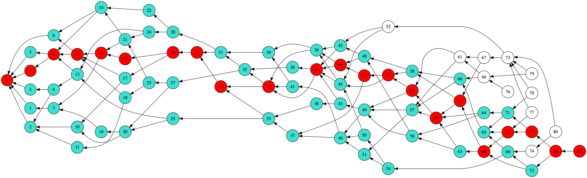
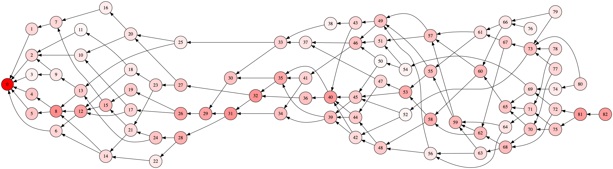
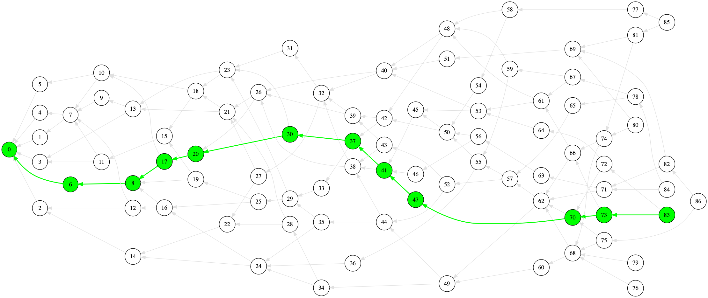

# res-attack-analysis-go
## ToDo
* Code refactoring
* Improve comments
* Better use of `interfaces`
* Check random generator usage within concurrency 

## Run the simulation

First, you need to [install Go](https://golang.org/doc/install) if it is not already installed on your machine. It is recommended that you use the most recent version of Go.

## Build

If you prefer, you can build your executable (as well as cross compiling for other architectures) by using the `go build` tool:

```
go build -o sim
```
You can then run your simulation by running:

```
./sim
```

## Parameters

|   Parameter       |       Type    | Description    |
|-------------------|:-------------:|:--------------|    
|   K               |   int         | number of tips to approve |
|   H               |   int         | network/computation delay |
|   Lambda          |   float64     | tx rate of occurance      |
|   Alpha           |   float64     | level of randomness in a random walk |
|   TangleSize      |   int         | number of txs forming the Tangle|
|   Seed            |   int64       | seed value of the PRNG|
|   TSA             |   string      | tip Selection Algorithm [`"URTS"`, `"RW"`, `"HPS"`]|
|   tsa             |   TipSelector | internal interface [`URTS`, `URW`, `BRW`, `HPS`]|
|   ConstantRate    |   bool        | if true enables constant tx rate, i.e., _1/Lambda_|
|   DataPath        |   string      | path to store results (currently unused)|
|   minCut          |   int         | initial part of the Tangle not considered for results, i.e., 30H * Lambda|
|   maxCut          |   int         | final part of the Tangle not considered for results, i.e., 30H * Lambda|
|   nRun            |   int         | number of Tangles simulated |
|   VelocityEnabled |   bool        | if true enables statistics on velocity of particles |

## Notes on parallelization

In the `main.go` file, a global variable `nParallelSims` is defined as: 
```go
var nParallelSims = runtime.NumCPU()/2 - 1
```
This variable defines the number of simulations to run in parallel. 
The GO function `runtime.NumCPU()` returns the number of logical cores of your machine. 
Potentially one could use all her/his available logical cores, but I've noticed that you start loosing performance when concurrency kicks in. For example, having a 6-core architecture implies only 6 physical cores, which might become 12 logical cores depending on your machine. Logical cores only help the processor to multitasking, thus, when it comes to parallelization it is recommended to stick with a maximum value for `nParallelSims` set to the maximum number of your _physical_ cores. One additonal core can be subtructed to have it for your web surfing while waiting for your results drinking a :coffee:

## Visualization

This is an example of visualizing the result of the simulation

The Tangle


Ghost particle path and its cone


Visiting probability in red gradients


Random walker path
